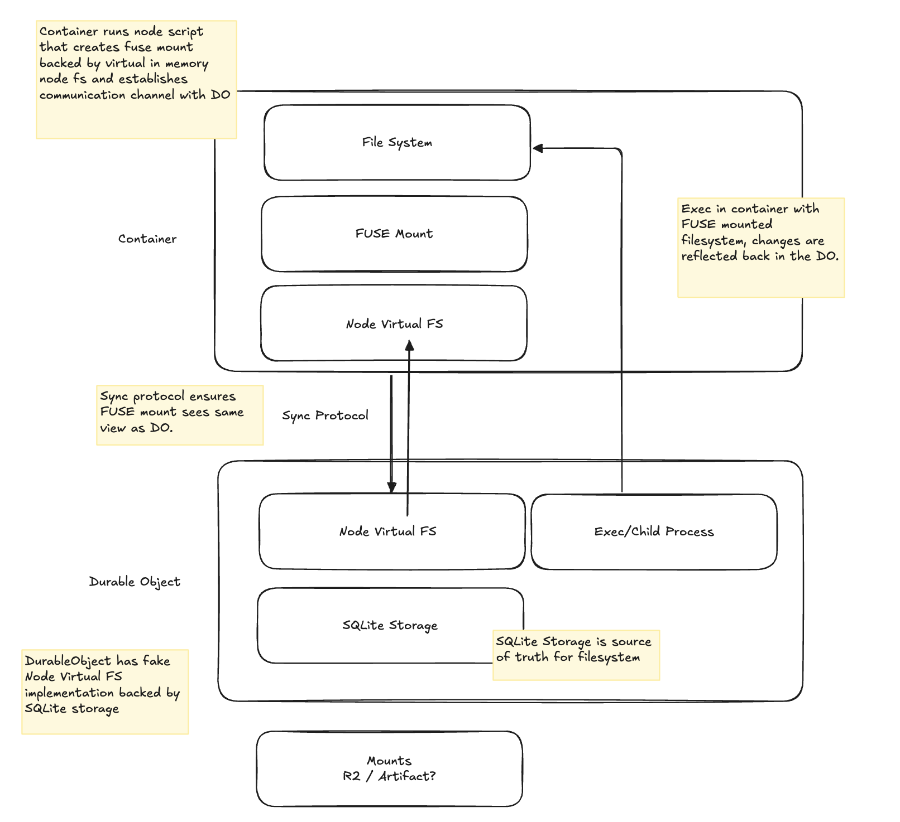

# `@cloudflare/workspace`

The `@cloudflare/workspace` package provides an out of the box virtual filesystem for use in any Durable Object — it's persistent and backed by SQLite. It's primarily designed for agents that need small, portable filesystems and tools to work with.



It provides:

 - A fs API for working with files and directories compatible with Worker bindings.
 - Mounts for pre-filling data from R2 or Artifacts.
 - Durability over DO restarts for all file operations.
 - Container/Sandbox support via FUSE mount, mirroring the same filesystem in a container.
 - Out-of-the-box tools for `@cloudflare/agents`.

It comes with the following limitations:

 - ~10GB maximum (it shares storage with the DO).
 - The container-side filesystem is held in memory, so very large trees aren't a fit. Aim for agent-scale workspaces, not full monorepos.
 - Container access goes through FUSE, so heavy IO workloads (large `node_modules` installs, big tarball extractions) take a measurable performance hit compared to a native filesystem.
 - First read of a lazy mount fetches over the network. Use `workspace.prefetch()` from `onStart` if cold-start latency on `grep`/`exec` matters.

## Installation

Install the package into your Worker/Agent project:

```sh
npm install @cloudflare/workspace
```

The package ships two entrypoints:

| Entrypoint | Where it runs |
| --- | --- |
| `@cloudflare/workspace` | The Durable Object (your agent). |
| `@cloudflare/workspace/shared` | Wire types shared with the in-container service. |

### Sandbox container image

The container needs the workspace server alongside a FUSE runtime. The recommended pattern is a multi-stage Docker build that copies the pre-built `ws.js` out of the published `cloudflare/workspace` image:

```dockerfile
# Stage 1: pull the pre-built workspace server out of the published image.
FROM cloudflare/workspace:latest AS workspace

# Stage 2: your sandbox image.
FROM cloudflare/sandbox:latest

RUN apt-get update && apt-get install -y --no-install-recommends \
      fuse3 libfuse2 ca-certificates \
    && rm -rf /var/lib/apt/lists/*

WORKDIR /app
COPY --from=workspace /app/ws.js ./ws.js

# ...your own tools below (compilers, runtimes, language SDKs)...

EXPOSE 4567
```

The `Workspace` class boots `ws.js` for you on the first `exec()` or `warmup()` call — see [07. Injected Service](./07_injected_service.md) for the boot sequence and env vars.

## Example

```ts
import { AIChatAgent } from "@cloudflare/ai-chat";
import { Workspace } from "@cloudflare/workspace";

export class Agent extends AIChatAgent<Env> {
	readonly workspace: Workspace;

	constructor(...args: ConstructorParameters<typeof AIChatAgent>) {
		super(...(args as [any, any]));
		this.workspace = new Workspace({
			storage:   this.ctx.storage,   // DO storage → VFS lives here
			sandbox:   this.env.Sandbox,   // DO namespace for the sandbox container
			sessionId: this.name,          // routes to a specific sandbox instance
			mounts: {
			    "/workspace/.agents/skills": R2Bucket(env.SHARED_FILES, { prefix: ".agents/skills" }),
			    "/workspace/project": GitHubRepo("cloudflare/agents", { env }),
			    "/workspace/documentation": GitHubRepo("cloudflare/cloudflare-docs", { prefix: "/src/content/docs/agents/", env }),
			}
		});
		this.workspace.fs.mkdir("/workspace");
	}

    onStart() {
		// Boot the container in the background so the first exec is warm.
		this.ctx.waitUntil(this.workspace.warmup().catch(() => {}));
    }
}
```

Once you have a `workspace` on your agent, the `fs` and `shell` surfaces feel a lot like Node's `fs/promises` and a shell session — everything is async, paths are absolute, and operations are durable across DO restarts.

Create and write files:

```ts
// Write a string (utf8 by default for strings).
await this.workspace.fs.writeFile("/workspace/notes/todo.md", "- [ ] ship it\n");

// Write binary content.
await this.workspace.fs.writeFile("/workspace/data/blob.bin", new Uint8Array([1, 2, 3]));

// Stream a large upload straight to disk.
await this.workspace.fs.writeFile("/workspace/uploads/big.csv", request.body!);
```

Read files back:

```ts
// As a string.
const todo = await this.workspace.fs.readFile("/workspace/notes/todo.md", "utf8");

// As a stream — handy for piping into a Response.
const stream = await this.workspace.fs.readFile("/workspace/uploads/big.csv");
return new Response(stream);
```

Create and walk directories:

```ts
await this.workspace.fs.mkdir("/workspace/notes/daily", { recursive: true });

for (const entry of await this.workspace.fs.readdir("/workspace/notes")) {
  console.log(entry.isDirectory ? `d ${entry.name}` : `f ${entry.name}`);
}
```

Remove files and directories:

```ts
await this.workspace.fs.rm("/workspace/notes/todo.md");
await this.workspace.fs.rm("/workspace/notes/daily", { recursive: true });
```

Search across the tree:

```ts
const hits = await this.workspace.fs.grep("TODO", "/workspace", { ignoreCase: true });
for (const hit of hits) {
  console.log(`${hit.path}:${hit.line}: ${hit.text}`);
}
```

Run a shell command in the sandbox — the same filesystem is mounted there, so writes from `fs` are immediately visible to `exec` and vice versa:

```ts
const run = await this.workspace.shell.exec("ls -la /workspace", { encoding: "utf8" });
const { stdout, exit } = await run.result();
console.log(stdout, exit);
```

`exec` returns a `ReadableStream` of events as well as the buffered `result()`. That makes it straightforward to forward live output to the browser as a Server-Sent Events stream — just transform each event into an SSE frame:

```ts
// Inside a fetch handler on your Agent.
async fetch(request: Request) {
  const run = await this.workspace.shell.exec("npm test", { encoding: "utf8" });

  const sse = run.pipeThrough(
    new TransformStream<
      { id: string; name: "stdout" | "stderr"; value: string } | { id: string; name: "exit"; value: number },
      Uint8Array
    >({
      transform(event, controller) {
        // SSE frame: `event: <name>\ndata: <json>\n\n`
        const frame = `event: ${event.name}\ndata: ${JSON.stringify(event.value)}\n\n`;
        controller.enqueue(new TextEncoder().encode(frame));
      },
    }),
  );

  return new Response(sse, {
    headers: {
      "content-type":  "text/event-stream",
      "cache-control": "no-cache",
      "connection":    "keep-alive",
    },
  });
}
```

On the client:

```ts
const events = new EventSource("/agent/run");
events.addEventListener("stdout", (e) => console.log(JSON.parse(e.data)));
events.addEventListener("stderr", (e) => console.warn(JSON.parse(e.data)));
events.addEventListener("exit",   (e) => { console.log("exit", JSON.parse(e.data)); events.close(); });
```

## Documentation

This package is documented as a set of focused topics. Start with the overview
above, then dive into the area you're working on.

| Document | Topic |
| --- | --- |
| [01. Directory Structure](./01_directory_structure.md) | Layout of the workspace tree, reserved paths, and mount points. |
| [02. Sync Protocol](./02_sync_protocol.md) | How the DO-backed VFS synchronises with the sandbox container. |
| [03. Filesystem Schema](./03_filesystem_schema.md) | SQLite schema backing the virtual filesystem. |
| [04. Filesystem Interface](./04_filesystem_interface.md) | `Workspace.fs` API: `readFile`, `writeFile`, `mkdir`, `grep`, etc. |
| [05. Shell Interface](./05_shell_interface.md) | `Workspace.shell.exec` and streamed command execution. |
| [06. Mount Interface](./06_mount_interface.md) | Pre-filling paths from R2, Artifacts, GitHub, and custom sources. |
| [07. Injected Service](./07_injected_service.md) | The in-container service that backs FUSE and shell. |
| [08. Capnweb Interface](./08_capnweb_interface.md) | RPC wire protocol between the DO and the sandbox. |
| [09. Tool Interface (Agents)](./09_tool_interface.md) | Ready-made tools for `@cloudflare/agents`. |
| [10. Project Layout](./10_project_layout.md) | Source tree of this package and how the pieces fit together. |

## High-level API

```ts
interface Workspace {
  fs:    WorkspaceFilesystem;     // 04_filesystem_interface.md
  shell: WorkspaceShell;          // 05_shell_interface.md

  /** Push pending DO-side writes to the container. */
  push():     Promise<void>;
  /** Pull container-side writes back into the DO. */
  pull():     Promise<void>;
  /** Boot the sandbox container in the background. */
  warmup():   Promise<void>;
  /** Hydrate lazy mount stubs ahead of first read. */
  prefetch(root?: string): Promise<void>;
  /** Sweep unreferenced blobs and manifests. */
  gc(safetyWindowMs?: number): Promise<{ blobsFreed: number; manifestsFreed: number }>;
}
```

See [04. Filesystem Interface](./04_filesystem_interface.md) and
[05. Shell Interface](./05_shell_interface.md) for the full surface, and [02. Sync Protocol](./02_sync_protocol.md) for `push`/`pull` semantics.
